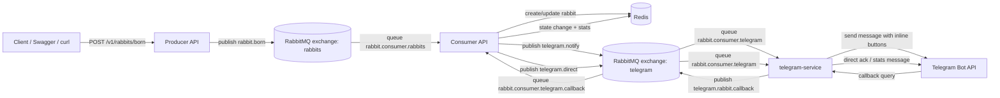

# Rabbit Monorepo

Монорепозиторий с микросервисами на NestJS:
- `producer` — принимает HTTP-запросы и публикует событие рождения кролика в RabbitMQ.
- `consumer` — обрабатывает события из RabbitMQ, хранит данные в Redis, отдает REST API, принимает callback из Telegram.
- `telegram-service` — рассылает уведомления в Telegram и отправляет действия по кнопкам обратно в RabbitMQ.

## Состав инфраструктуры

Через `docker-compose.yml` поднимаются:
- RabbitMQ (AMQP + Management UI)
- Redis
- Producer API
- Consumer API
- Telegram Service

## Запуск проекта

В корне репозитория:

```bash
docker compose up --build -d
```

Важно!
При запуске с территории РФ необходимо обеспечить подклюение к telegram для нормальной работы сервиса telegram-service

Проверка, что все сервисы поднялись:

```bash
docker ps
```

Остановка:

```bash
docker compose down
```

Остановка с удалением volume данных:

```bash
docker compose down -v
```

## Адреса сервисов

- Producer API: `http://localhost:3000`
- Consumer API: `http://localhost:3001`
- Telegram Service: `http://localhost:3020`
- RabbitMQ AMQP: `localhost:5672`
- RabbitMQ UI: `http://localhost:15672` (логин/пароль: `rabbit` / `rabbit`)
- Redis: `localhost:6379`

## Swagger

- Producer Swagger: `http://localhost:3000/v1/bi/api`
- Consumer Swagger: `http://localhost:3001/v1/bi/api`

## Основные эндпоинты

### Producer
- `POST /v1/rabbits/born` — создать событие рождения кролика.

### Consumer
- `GET /v1/rabbits/search` — поиск кроликов.
- `GET /v1/rabbits/:rabbitId` — получить кролика по id.
- `PATCH /v1/rabbits/:rabbitId` — обновить кролика.
- `DELETE /v1/rabbits/shoot-them-all` — удалить всех кроликов, очистить статистику.

## Тестовый сквозной кейс

### 1) Подпишитесь на уведомления в Telegram

Найти Telegram бота "Rabbits Control Desk"

В боте отправьте команду:

```text
/start
```

### 2) Отправьте событие рождения кролика

```bash
curl -X POST "http://localhost:3000/v1/rabbits/born" \
  -H "Content-Type: application/json" \
  -d '{
    "age": 1,
    "name": "Fluffy",
    "color": "GREY",
    "speed": 12,
    "isHungry": true
  }'
```

Ожидаемо:
- Producer вернет `201` и `id` нового кролика.
- Consumer сохранит кролика в Redis.
- В Telegram придет сообщение с кнопками:
  - `В клетку`
  - `Выпустить`
  - `Пристрелить`

### 3) Проверка, что кролик сохранен

```bash
curl "http://localhost:3001/v1/rabbits/search"
```

В выдаче должен быть созданный кролик.

### 4) Распределение через Telegram

Нажмите кнопку под уведомлением в Telegram:
- `В клетку` -> allocation становится `IN_CAGE`
- `Выпустить` -> allocation становится `FREE_ROAMING`
- `Пристрелить` -> кролик удаляется, счетчик пристреленных увеличивается

После нажатия бот отправляет подтверждение и актуальную статистику.

### 5) Проверка результата в API

Повторно проверьте состояние:

```bash
curl "http://localhost:3001/v1/rabbits/search"
```

## Примечание

В тестовой конфигурации токен Telegram-бота и прочие env-переменные заданы прямо в `docker-compose.yml`.

## Схема взаимодействия сервисов



Ключевые роли компонентов:
- `RabbitMQ` — транспортная шина между сервисами (`producer` -> `consumer` -> `telegram-service` -> `consumer`).
- `Redis` — хранилище состояния кроликов, статистики и блокировок callback.
- `producer` — только публикация события рождения.
- `consumer` — бизнес-логика, состояние и реакция на callback-действия.
- `telegram-service` — доставка уведомлений и обратная отправка callback-событий в шину.
